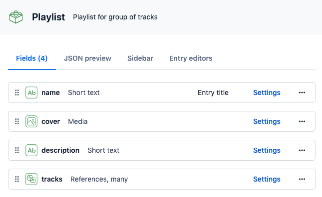
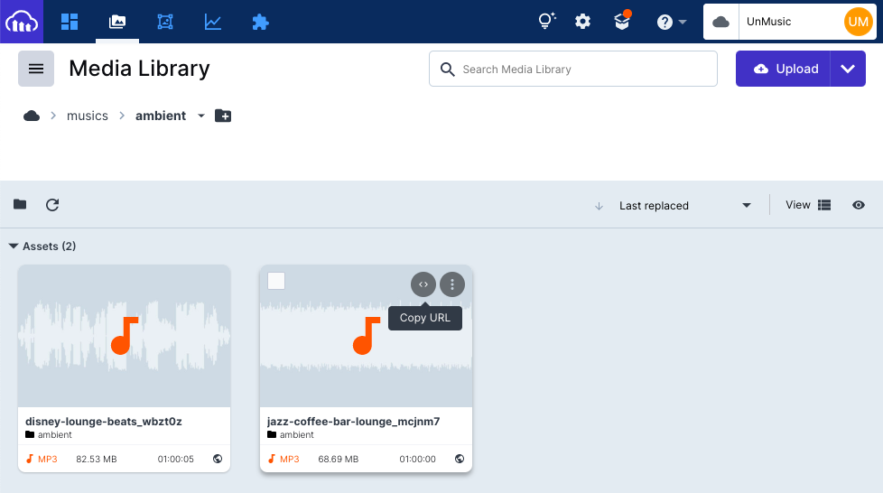

## Productivity music for Developers

&nbsp;
&nbsp;

### Prerequisite

Sign up for the following services and grab the API keys:

- [Contentful](https://www.contentful.com) - CMS for managing the contents of the app (20000 Records & 2,000,000 API Calls/month in free tier)
- [Cloudinary](https://cloudinary.com/invites/lpov9zyyucivvxsnalc5/ccvdwhixsfyxtjdy3kcs?t=default) - Content Delivery service for hosting audio files for streaming (25 GB/month in free tier)
- [Amplitude](https://www.amplitude.com) - App usage analytics (Optional)
- [Sentry](https://sentry.io) - Error monitoring in production (Optional)

&nbsp;
&nbsp;

### Contentful Model Creation

- Create two models in the Contentful dashboard named `Playlist` and `Track`.

  
  
- `Playlist` model for saving the list of tracks, which will contain the following fields:

  
  
- `Track` model for saving the track information, which will contain the following fields:

  

&nbsp;
&nbsp;

### Cloudinary Assets Hosting

- Login into your Cloudinary account and create folder and upload all of your MP3 files

  
  
- Copy the public URL for each file by clicking on the `Copy URL` button

  

&nbsp;
&nbsp;

### Installation

- Clone the repository by running `git clone git@github.com:unmusic/unmusic.github.io.git`
- Get inside the `/web` folder
- Add a file named `.env.local` and replace it with contents of `.env.sample`
- Make sure you update all the environment variables below:

  - `REACT_APP_CONTENTFUL_SPACE_ID`
  - `REACT_APP_CONTENTFUL_ACCESS_TOKEN`
  - `REACT_APP_AMPLITUDE_API_KEY` (Optional)
  - `REACT_APP_SENTRY_DSN` (Optional)

- Install all the dependencies by running `npm install`
- Run `npm start` to start the application in the development mode. The app will be running at [http://localhost:3000](http://localhost:3000).
